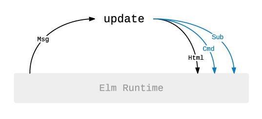

# Elm - Introduction

## Installation, Editors and Plugins

To install Elm, follow the official [installation guide](https://guide.elm-lang.org/install.html). There is also a section about how to configure different editors to work with Elm.

Make sure to install [elm-format](https://github.com/avh4/elm-format) to your editor as well.

There is also an online live editor for Elm called [Ellie](https://ellie-app.com).

## What is Elm

According to the official website [elm-lang.org](https://elm-lang.org):

> A delightful language for reliable webapps.
>
> Generate JavaScript with great performance and no runtime exceptions.

It is a reactive pure functional programming language with syntax inspired by Haskell that compiles to JavaScript. It is designed for building reliable web applications with no runtime exceptions. Elm is one of the solutions for [the JavaScript problem](https://wiki.haskell.org/The_JavaScript_Problem). The [compiler](https://github.com/elm/compiler) is implemented in Haskell.

Elm is language **and** a framework for building front-end web applications.

### Advantages

- static strong type system, no `null` or `undefined` (static code analysis, when it compiles, it works)
- pure functions (no side effects, allows tree shaking on a function level)
- everything necessary for building front end apps is already included in the language
- standard ways how to do things, so it is easy to understand other people's code
- easy refactoring

### Disadvantages

- need for learning a new language
- sometimes, more code is needed than it would be in JavaScript (e.g., when parsing JSONs)
- lightweight Haskell (e.g., no type classes, which can result in more boilerplate code)
- harder to find developers for Elm projects than for JavaScript projects.

### Compared to JavaScript

Elm has built-in common tools and features that are part of typical JavaScript stack.

| JavaScript      | Elm      |
| --------------- | -------- |
| npm/yarn        | built-in |
| Webpack         | built-in |
| React           | built-in |
| Redux           | built-in |
| TypeScript/Flow | built-in |
| Immutable.JS    | built-in |

## Elm REPL

If we have Elm installed, we can run Elm REPL by `elm repl` command. It is like `ghci` for Elm.

```
$ elm repl
---- Elm 0.19.1 ----------------------------------------------------------------
Read <https://github.com/elm/compiler/blob/master/hints/repl.md> to learn more: exit, help, imports, etc.
--------------------------------------------------------------------------------
>
```

_Note_: You can use same syntax in REPL. Next examples are make as it would be part of the source code.

## Elm Language

### Basic types

Strings are enclosed in double quotation mark `"`. We use `++` operator to join them.

### Naming things

If we want to give a name to expression, we use the `=` operator.

```elm
a =
    5
```

#### String

```elm
hello =
    "Hello world!"


hello2 =
    "Hello" ++ " " ++ "world!"
```

#### Numbers

Elm has two number types `Int` and `Float` and constrained type variable (see below few more) `number` which can be either `Int` or `Float`.

```elm
plus =
    5 + 5 -- 10


power =
    2 ^ 8 -- 256


divide =
    2 / 3 -- 0.6666666666666666


divide_ =
    7 // 2 -- 3


modBy_ =
    modBy 7 2 -- 2
```

#### Bool and logical operators

Elm has standard operators for comparison and boolean operations. Same as in Haskell, it uses `/=` operator for inequality.

```elm
compare =
    5 > 7 -- False


equal =
    (5 == 7) -- False


notEqual =
    (5 /= 7) -- True


not =
    not (5 /= 7) -- False


or =
    False || True -- True


and =
    False && True -- True
```

### Function

The definition and function call looks the same as in Haskell.

```elm
linear a b x =
    a * x + b

linearResult =
    linear 5 3 7 -- 38
```

### If expression

```elm
ifCondition =
    if True then
        "It is true!"

    else
        "It is not true."

```

### Comments

Elm has multiline and single-line comments.

```elm
{-
	a multiline comment
-}

-- a single line comment

```

### The Elm project

The easiest way to initialize an Elm project is to use `elm init` command.

```
$ elm init
Hello! Elm projects always start with an elm.json file. I can create them!

Now you may be wondering, what will be in this file? How do I add Elm files to
my project? How do I see it in the browser? How will my code grow? Do I need
more directories? What about tests? Etc.

Check out <https://elm-lang.org/0.19.1/init> for all the answers!

Knowing all that, would you like me to create an elm.json file now? [Y/n]: y
Okay, I created it. Now read that link!

$ ls
elm.json src
```

It generates `elm.json` file that defines where the source files are and what are the project dependencies.

```json
{
  "type": "application",
  "source-directories": ["src"],
  "elm-version": "0.19.1",
  "dependencies": {
    "direct": {
      "elm/browser": "1.0.2",
      "elm/core": "1.0.5",
      "elm/html": "1.0.0"
    },
    "indirect": {
      "elm/json": "1.1.3",
      "elm/time": "1.0.0",
      "elm/url": "1.0.0",
      "elm/virtual-dom": "1.0.2"
    }
  },
  "test-dependencies": {
    "direct": {},
    "indirect": {}
  }
}
```

### Modules

Now, when we have our project ready, we can create some modules. A module has a name which need to be the same as the file name - whole absolute path (e. g. `Lib.Math`, etc.). It has to state what expression from the module should be exposed explicitly.

```elm
-- src/Lib/Math.elm

module Lib.Math exposing (linear)


linear a b x =
    a * x + b
```

We can import the module to other modules or the repl using `import` statement. If we use just `import Lib` we need to use the full name for the expressions from the module.

```elm
import Lib.Math


linearResult =
    Lib.Math.linear 5 3 7 -- 38
```

We can also expose some expression and then use them without the full module name.

```elm
import Lib.Math exposing (linear)


linearResult =
    linear 5 3 7 -- 38
```

Or we can expose everything from the module.

```elm
import Lib.Math exposing (..)


linearResult =
    Lib.Math.linear 5 3 7 -- 38
```

Or we can import a module with a different name.

```elm
import Lib.Math as Math


linearResult =
    Math.linear 5 3 7 -- 38
```

### Type annotation

Elm can infer the types based on what we are doing. However, it is a good practice to define the types.

```elm
linear : Float -> Float -> Float -> Float
linear a b x =
    a * x + b
```

### Type variables

When the specific type is not important, we can use a type variable. Type names start with an uppercase letter (e.g., `Float`), type variable can be almost any string starting with a lowercase letter.

```elm
List.isEmpty : List a -> Bool

List.map : (a -> b) -> List a -> List b
```

#### Constrained Type Variables

There are several constrained type variables with a special meaning defined by the Elm language.

- `number` permits `Int` and `Float`
- `appendable` permits `String` and `List a`
- `comparable` permits `Int`, `Float`, `Char`, `String`, and lists/tuples of `comparable` values
- `compappend` permits `String` and `List comparable`

```elm
linear : number -> number -> number -> number
linear a b x =
    a * x + b
```

### List

A list is a collection of items of the same type with variable length. There is a [List](https://package.elm-lang.org/packages/elm/core/latest/List) module with various functions for working with lists.

```elm
numbers : List number
numbers =
    [ 1, 3, 5, 7, 11 ]

lenght : Int
lenght =
    List.length numbers -- 5


isEmpty : Bool
isEmpty =
    List.isEmpty numbers -- False


double : Float -> Float
double n =
    n * 2


doubleNumbers : List number
doubleNumbers =
    List.map double numbers -- [ 2, 6, 10, 14, 22 ]


doubleNumbers2 : List number
doubleNumbers2 =
    List.map (\n -> n * 2) numbers -- [ 2, 6, 10, 14, 22 ]


doubleNumbers3 : List number
doubleNumbers3 =
    List.map ((*) 2) numbers -- [ 2, 6, 10, 14, 22 ]
```

### Dict

Dict is a mapping of unique keys to values. There is a [Dict](https://package.elm-lang.org/packages/elm-lang/core/latest/Dict) module with functions for working with dicts.

```elm
-- Even if Dict is part of ELM core we need to import it
import Dict

newDict : Dict.Dict String number
newDict =
    Dict.fromList [ ( "Spencer", 25 ), ( "Zoe", 21 ) ] --

insertSpencer : Dict.Dict String number
insertSpencer =
    Dict.insert "Spencer" 25 Dict.empty

isEmpty : False
isEmpty =
    Dict.isEmpty dict

getZoe : Maybe number
getZoe =
    Dict.get "Zoe" newDict -- Just 21

getFrankie : Maybe number
getFrankie =
    Dict.get "Frankie" dict -- Nothing
```

### Tuple

A tuple is a collection of items of various type with the fixed size. There is a [Tuple](https://package.elm-lang.org/packages/elm/core/latest/Tuple) module for working with tuples. Tuples can be used when a function returns more than one value.

```elm
person : ( String, number )
person =
    ( "Joe", 21 )

joe : String
joe =
    Tuple.first person

number_ : number
number_ =
    Tuple.second person
```

We can use pattern matching for tuples in functions:

```elm
bio : ( String, Int ) -> String
bio ( name, age ) =
    name ++ " is " ++ ( String.fromInt age ) ++ " years old."
```

Elm has a limit on the maximum number of items in the tuple to be 3. If we need more, we should use a record or our own custom type.

```
> vector4 = ( 4, 10, 12, 3 )
-- BAD TUPLE --------------------------------------------------------------- elm

I only accept tuples with two or three items. This has too many:

8| vector4 = ( 4, 10, 12, 3 )
             ^^^^^^^^^^^^^^^^
I recommend switching to records. Each item will be named, and you can use the
`point.x` syntax to access them.

Note: Read <https://elm-lang.org/0.19.1/tuples> for more comprehensive advice on
working with large chunks of data in Elm.
```

### Record

Records contain keys and values. Each value can have a different type.

```elm
vector4 : { w : number, x : number1, y : number2, z : number3 }
vector4 =
    { w = 4
    , x = 10
    , y = 12
    , z = 3
    }

scatterChart :
    { points : List { x : number1, y : number2 }
    , title : String
    , xAxis : String
    , yAxis : String
    }
scatterChart =
    { points = [ { x = 11, y = 8 } ]
    , title = "Bar chart"
    , xAxis = "x"
    , yAxis = "y"
    }

```

For accessing record properties, Elm has by default accessors defined as `.<key>`. They can be used as `<record>.<key>`, but it is just syntactic sugar, they are just functions.

```elm
x : number
x =
    vector4.x -- 10

x_ : number
x_ =
    .x vector4 -- 10

listX : List number
listX =
    List.map .x [ vector4, vector4, vector4 ] -- [ 10, 10, 10 ]
```

If we have a look at the type of `.x` accessor, it says it is any record that has a field `x` of type `a` and returns `a`.

```elm
accessorX : { b | x : a } -> a -- { b | x : a } is extensible record
accessorX =
    .x
```

Since everything is immutable, records cannot be updated. We can create updated records though:

```elm
updatedVector4 : { w : number1, x : number, y : number2, z : number3 }
updatedVector4 =
    { vector4 | x = 20 } -- { w = 4, x = 20, y = 12, z = 3 }
```

We can use pattern matching (desctructuring) for record keys:

```elm
lenght : { b | w : Float, x : Float, y : Float, z : a } -> Float
length { w, x, y, z } = sqrt (w * w + x * x + y * y + w * w)

lengthResult : Float
lengthResult =
    length vector4 -- 16.61324772583615
```

#### Extensible records

An extensible record is a record defined as _having at least certain fields_. For example, a record can be defined as having at least an `id` and `name` fields.

We can use extensible records for type inheritance. IT has one limitation - we will see it next lessonin Decoders part.

```elm
type alias ExtensibleUser a =
    { a | id : String, name : String }

nameView : ExtensibleUser a -> Html msg -- we access only to id and name, nothing else
nameView { name } =
    ...
```

What we can do with extensible records?

```elm
type Role
    = Admin
    | Regular

type alias User =
    ExtensibleUser { role : Role }

user : User  -- doesn't matter about the order when defining new object
user =
    { id : "id"
    , role : Admin
    , name : "Joe"
    }

type alias BaseUser =
    ExtensibleUser {}

baseUser : BaseUser
baseUser =
    { id : "id"
    , name : "Joe"
    }

workingOrNot : User
workingOrNot =
    User "id" "Joe" Admin
```

### Type alias

Type aliases are used to give a new name to existing types. It is useful for naming record types.

```elm
-- naming
type alias Name =
    String

-- naming
type alias Age =
    Int

-- record
type alias Person =
    { name : Name
    , age : Age
    }

isAdult : Person -> Bool
isAdult { age } =
    age >= 18

getName : Person -> Name
getName { name } =
    name

getName2 : Person -> String
getName2 { name } =
    name

joe : Person
joe =
    { age = 21, name = "Joe" }

isJoeAdult : Bool
isJoeAdult =
    isAdult joe -- True

joe2 : Person
joe2 =
    Person "Joe" 21
```

_Note_: Type aliases are resolved in compiled time. Therefore, they cannot be recursive. For recursion, we need to use custom types.

### Custom Types

We can define custom types that have several variants. We can also associate data with a variant.

```elm
type Animal
    = Cat
    | Dog

type Tree a
    = Leaf a
    | Branch (Tree a) (Tree a)

type Profile
    = Loading
    | Error String
    | Success Person

animal : Animal
animal =
    Dog

tree : Tree number
tree =
    Branch (Leaf 1) (Branch (Leaf 2) (Leaf 0))

profile : Profile
profile =
    Error "Cannot load profile"
```

_Note_: There are two more complex techniques, how to design data structure - opaque types (next lesson) and phantom types.

### Pattern Matching

```elm
isDog : Animal -> Bool
isDog animal =
    case animal of
        Cat ->
            False

        Dog ->
            True
```

We can use wildcard `_` for all other branches in the `case` statement or for the variables we don't need.

```elm
isLoading : Profile -> Bool
isLoading profile =
    case profile of
        Loading ->
            True

        _ ->
            False

isLoading2 : Profile -> Bool
isLoading2 profile =
    profile == Loading

isLoading3 : Profile -> Bool
isLoading3 profile =
    case profile of
        Loading ->
            True

        Error _ ->
            False

        Success _ ->
            False

profileStatus : Profile -> String
profileStatus profile =
    case profile of
        Loading ->
            "Loading"

        Error error ->
            "Error: " ++ error

        Success _ ->
            "Success!"
```

We can use `::` operator for matching first element and rest of the list.

```elm
sum : List number -> number
sum list =
    case list of
        head :: tail ->
            head + sum tail

        [] ->
            0
```

### Maybe

`Maybe` is used when a result doesn't have to exist. Unlike `null` in JavaScript, we are forced to handle that case.

```elm
type Maybe a
  = Just a
  | Nothing
```

For example empty list doesn't have a head.

```elm
list : List a
list =
    []

headItem : Maybe a
headItem =
    List.head list -- Nothing
```

We can use the `Maybe` type in `case` statement as any other custom type.

```elm
hello : String -> String
hello name =
    "Hello, " ++ name ++ "!"

greet : Maybe String -> String
greet maybeName =
    case maybeName of
        Just name ->
            hello name

        Nothing ->
            "Nobody's here"
```

[Maybe](https://package.elm-lang.org/packages/elm/core/latest/Maybe) package contains a handful of useful functions to simplify working with maybes.

```elm
withDefault : a -> Maybe a -> a
withDefault =
    Maybe.withDefault

withDefaultJust : String
withDefaultJust =
    Maybe.withDefault "default" (Just "value") -- "value"

withDefaultNothing : String
withDefaultNothing =
    Maybe.withDefault "default" Nothing -- "default"
```

```elm
maybeMap : (a -> b) -> Maybe a -> Maybe b
maybeMap =
    Maybe.map

result : Maybe number
result =
    Maybe.map ((*) 2) (Just 4) -- Just 8

resultNothing : Maybe number
resultNothing =
    Maybe.map ((*) 2) Nothing -- Nothing

```

```elm
greet2 : Maybe String -> String
greet2 maybeName =
    Maybe.withDefault "Nobody's here" (Maybe.map hello maybeName)
```

### Result

`Result` is used for computations that may fail. Response from http request is `Result` - `Result Http.Error response`.

```elm
type Result error value
  = Ok value
  | Err error
```

For example, we cannot calculate area with of rectangle with negative sides.

```elm
rectArea : Float -> Float -> Result String Float
rectArea a b =
    if a < 0 || b < 0 then
        Err "Cannot calculate area with negative sides"

    else
        Ok (a * b)
```

There are again helpful functions in [Result](https://package.elm-lang.org/packages/elm/core/latest/Result) package.

### let expressions

It is sometimes handy to define some expression within a function to avoid repetition. We have let expressions for that. Otherwise there is implicit return from every function. We can also nest `let` - `in` blocks.

```elm
cubeArea : Float -> Float
cubeArea edge =
    let
        face =
            edge ^ 2
    in
    6 * face
```

### Operators |>, <|, >>, <<

Elm has several operators for chaining functions and function calls together.

#### |>

`|>` operator takes a value and a function and applies the function to the value. It is useful when chaining more steps together to write readable code.

```elm
pipe : : a -> (a -> b) -> b
pipe =
    (|>)

greet3 : Maybe String -> String
greet3 maybeName =
    maybeName
        |> Maybe.map hello
        |> Maybe.withDefault "Nobody's here"
```

#### <|

`<|` operator is the opposite. It takes a function and a value and apply the function to the value. It is useful to avoid parentheses, the same as `$` in Haskell.

```elm
pipe : : (a -> b) -> a -> b
pipe =
    (<|)

greet4 : Maybe String -> String
greet4 maybeName =
    Maybe.withDefault "Nobody's here" <| Maybe.map hello maybeName
```

#### >>

`>>` is used for function composition - `(f >> g) x == g(f x)`.

```elm
functionComposition : (a -> b) -> (b -> c) -> a -> c
functionComposition =
    (>>)

greet5 : Maybe String -> String
greet5 =
    Maybe.map hello >> Maybe.withDefault "Nobody's here"
```

#### <<

`>>` is used for function composition in an opposite direction - `(f << g) x == f(g x)`. This is same as `.` in Haskell.

```elm
functionComposition : (b -> c) -> (a -> b) -> a -> c
functionComposition =
    (<<)

greet6 : Maybe String -> String
greet6 =
    Maybe.withDefault "Nobody's here" << Maybe.map hello
```

### Debug

Elm has a [Debug](https://package.elm-lang.org/packages/elm-lang/core/latest/Debug) package intended for debugging. It
should not be used in production code.

`log` function can be used to write a value to console.

```elm
Debug.log "value" 1 -- 1
```

## Packages

Elm packages are published on [package.elm-lang.org](https://package.elm-lang.org). There is forced [semantic versioning](https://semver.org) for Elm packages.

To install a package, we use `elm install` command in the project directory.

```
$ elm install elm-community/maybe-extra
Here is my plan:

  Add:
    elm-community/maybe-extra    5.3.0

Would you like me to update your elm.json accordingly? [Y/n]: y
Dependencies loaded from local cache.
Dependencies ready!
```

Then we can use the new package the same as we used our package before:

```elm
import Maybe.Extra exposing (isNothing)

result : Bool
result =
    isNothing Nothing -- True
```

## The Elm Architecture (TEA)

The Elm Architecture is a pattern used by Elm applications to define the architecture. It is perfect for modularity, refactoring, code reuse and testing. It is easy to keep even the complex applications clean and maintainable with the TEA.
The Elm application has three main parts:

- **Model** - The state of the application.
- **Update** - How to change the state.
- **View** - How to display the state.

There are also Subscribers and Commands. We will talk about them later.



### Example

Example form [Elm guide](https://guide.elm-lang.org/#a-quick-sample):

```elm
import Browser
import Html
import Html.Events as Events

main =
  Browser.sandbox { init = 0, update = update, view = view }

type Msg
    = Increment
    | Decrement

type alias Model =
    Int

update : Msg -> Model -> ( Model, Cmd Msg )
update msg model =
  case msg of
    Increment ->
      ( model + 1, Cmd.none )

    Decrement ->
      ( model - 1, Cmd.none )

view : Model -> Html.Html Msg
view model =
  Html.div []
    [ Html.button [ Events.onClick Decrement ] [ text "-" ]
    , Html.div [] [ Html.text <| String.fromInt model ]
    , Html.button [ Events.onClick Increment ] [ text "+" ]
    ]
```

## Generate HTML + styling

HTML is fully generated by elm - elm functions, syntax, etc. We can easily connect `Msg` to `onClick` for buttons and other events. With that HTML is always under ELM control and we have type guarantees when working with it.

```elm
import Html
import Html.Attributes as Attributes

divView : List (Attribute msg) -> List (Html.Html msg) -> Html.Html msg
divView =
    Html.div

greetingView : Html.Html msg
greetingView =
    Html.div
        [ Attributes.style "background-color" "red"
        , Attributes.style "height" "90px"
        , Attributes.style "width" "100%"
        ]
        [ Html.text "Hello!"
        ]
```

First argument is list `Attribute`s - events, id, className, inline styles, etc. Second argument is list for child nodes. By the second argument we are implementing html hierarchy.

We have access to all HTML elements - `link`, `label`, `input`, `h1`, `h2`, etc.

If you don't want to type you own `CSS`, you can use packages for layout and elements - for example [elm-ui](https://package.elm-lang.org/packages/mdgriffith/elm-ui/latest/).

_Note_: Elm is using (same as React) Virtual DOM feature

## Running the Elm application

### Elm Reactor

It is a quick and simple tool to run Elm project during development. Run `elm reactor` in the project root. It starts a server at [http://localhost:8000](http://localhost:8000) where we can navigate to Elm files.

## Elm program

Elm program is set up using [Browser](https://package.elm-lang.org/packages/elm/browser/latest/Browser) module from [elm/browser](https://package.elm-lang.org/packages/elm/browser/latest/) package. There are several functions to do that based on the use case.

- `sandbox` - Program that interacts with the user input but cannot communicate with the outside world.
- `element` - HTML element controlled by Elm that can talk to the outside world (e.g. HTTP requests). Can be embedded into a JavaScript project.
- `document` - Controls the whole HTML document, view controls `<title>` and `<body>` elements.
- `application` - Creates single page application, Elm controls not only the whole document but also Url changes.

### Elm Make

Tool for building Elm project. It can compile to HTML or JavaScript. For example:

```
$ elm make src/Main.elm --output=main.html
```

Generates `main.html` file with the Elm application.

## Further reading

### Alternatives

### [Haste](https://haste-lang.org)

Haste is a tool for compiling Haskell code into a JavaScript code and a server-side binary. Both programs can talk to each other ensuring type-safe communication.

### [GHCJS](https://github.com/ghcjs/ghcjs)

GHCJS is a compiler for Haskell to JavaScript that uses GHC API. It supports a wide range of Haskell features, including all type system extensions supported by GHC. There are some interesting frameworks for building web applications based on GHCJS:

- [Reflex](https://reflex-frp.org) - A composable, cross-platform functional reactive programming framework for Haskell.
- [miso](https://haskell-miso.org) - A tasty Haskell front-end framework.

### [PureScript](http://www.purescript.org)

PureScript is a strongly-typed functional programming language that compiles to JavaScript. It is similar to Haskell with [some differences](https://github.com/purescript/documentation/blob/master/language/Differences-from-Haskell.md). It has a lot of packages published in [Pursuit](https://pursuit.purescript.org). Also, some frameworks for building web applications are there, e.g.:

- [Thermite](https://github.com/paf31/purescript-thermite) - A simple PureScript wrapper for React.
- [Halogen](https://github.com/slamdata/purescript-halogen) - A declarative, type-safe UI library for PureScript.
- [Pux](https://github.com/alexmingoia/purescript-pux) - A library for building type-safe web applications.

If you are interested, you can have a look at this comparison: [Benchmarks: GHCJS (Reflex, Miso) & Purescript (Pux, Thermite, Halogen)](https://medium.com/@saurabhnanda/benchmarks-fp-languages-libraries-for-front-end-development-a11af0542f7e)

### [ReasonML](https://reasonml.github.io)

Reason is a new syntax and toolchain based on OCaml programing language created by Facebook. The syntax is closer to JavaScript than OCaml. It is intended for development of front-end web applications and compiles to JavaScript. Using existing JavaScript and OCaml packages is possible.

### Usefull links

- [An Introduction to Elm](https://guide.elm-lang.org)
- [Elm Syntax](https://elm-lang.org/docs/syntax)
- [Korban book](https://korban.net/elm/book/)
- [Small Assets without the Headache](https://elm-lang.org/blog/small-assets-without-the-headache)
- [Elm in Production: Surprises & Pain Points](https://www.youtube.com/watch?v=LZj_1qVURL0)
- [Elm-demo](https://github.com/deny1994/elm-demo)
