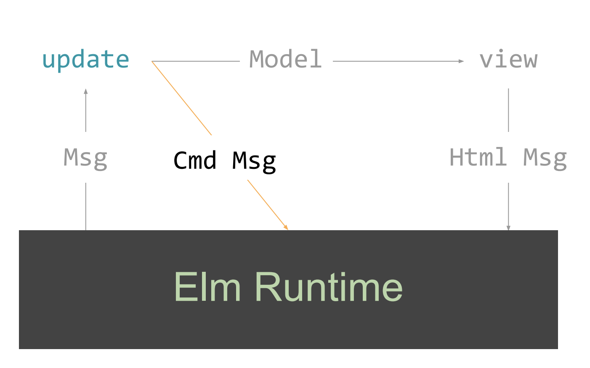

# Elm - Introduction

## Installation, Editors and Plugins

To install Elm, follow the official [installation guide](https://guide.elm-lang.org/install.html). There is also a section about how to configure different editors to work with Elm.

Make sure to install [elm-format](https://github.com/avh4/elm-format) to your editor as well.

There is also an online live editor for Elm called [Ellie](https://ellie-app.com).


## What is Elm

According to the official website [elm-lang.org](https://elm-lang.org):

> A delightful language for reliable webapps.
>
> Generate JavaScript with great performance and no runtime exceptions.

It is a reactive pure functional programming language with syntax inspired by Haskell that compiles to JavaScript. It is designed for building reliable web applications with no runtime exceptions. Elm is one of the solutions for [the JavaScript problem](https://wiki.haskell.org/The_JavaScript_Problem). The [compiler](https://github.com/elm/compiler) is implemented in Haskell.


Elm is language **and** a framework for building front-end web applications.

### Advantages

- static strong type system, no `null` or `undefined` (static code analysis, when it compiles, it works)
- pure functions (no side effects, allows tree shaking on a function level)
- everything necessary for building front end apps is already included in the language
- standard ways how to do things, so it is easy to understand other people's code
- easy refactoring

### Disadvantages

- need for learning a new language
- sometimes, more code is needed than it would be in JavaScript (e.g., when parsing JSONs)
- lightweight Haskell (e.g., no type classes, which can result in more boilerplate code)
- harder to find developers for Elm projects than for JavaScript projects.

### Compared to JavaScript

Elm has built-in common tools and features that are part of typical JavaScript stack.

| JavaScript | Elm|
| --- | --- |
| npm/yarn | built-in |
| Webpack | built-in |
| React | built-in |
| Redux | built-in |
| TypeScript/Flow | built-in |
| Immutable.JS | built-in |


## Alternatives

### [Haste](https://haste-lang.org)

Haste is a tool for compiling Haskell code into a JavaScript code and a server-side binary. Both programs can talk to each other ensuring type-safe communication.

### [GHCJS](https://github.com/ghcjs/ghcjs)

GHCJS is a compiler for Haskell to JavaScript that uses GHC API. It supports a wide range of Haskell features, including all type system extensions supported by GHC. There are some interesting frameworks for building web applications based on GHCJS:

- [Reflex](https://reflex-frp.org) - A composable, cross-platform functional reactive programming framework for Haskell.
- [miso](https://haskell-miso.org) - A tasty Haskell front-end framework.

### [PureScript](http://www.purescript.org)

PureScript is a strongly-typed functional programming language that compiles to JavaScript. It is similar to Haskell with [some differences](https://github.com/purescript/documentation/blob/master/language/Differences-from-Haskell.md). It has a lot of packages published in [Pursuit](https://pursuit.purescript.org). Also, some frameworks for building web applications are there, e.g.:

- [Thermite](https://github.com/paf31/purescript-thermite) - A simple PureScript wrapper for React.
- [Halogen](https://github.com/slamdata/purescript-halogen) - A declarative, type-safe UI library for PureScript.
- [Pux](https://github.com/alexmingoia/purescript-pux) - A library for building type-safe web applications.

If you are interested, you can have a look at this comparison: [Benchmarks: GHCJS (Reflex, Miso) & Purescript (Pux, Thermite, Halogen)](https://medium.com/@saurabhnanda/benchmarks-fp-languages-libraries-for-front-end-development-a11af0542f7e)

### [ReasonML](https://reasonml.github.io)

Reason is a new syntax and toolchain based on OCaml programing language created by Facebook. The syntax is closer to JavaScript than OCaml. It is intended for development of front-end web applications and compiles to JavaScript. Using existing JavaScript and OCaml packages is possible.


## Elm REPL

If we have Elm installed, we can run Elm REPL by `elm repl` command. It is like `ghci` for Elm.

```
$ elm repl
---- Elm 0.19.1 ----------------------------------------------------------------
Read <https://github.com/elm/compiler/blob/master/hints/repl.md> to learn more: exit, help, imports, etc.
--------------------------------------------------------------------------------
>
```


## Elm Language

### Basic types

Strings are enclosed in double quotation mark `"`. We use `++` operator to join them.

#### String

```elm
> "Hello world!"
"Hello world!" : String

> "Hello " ++ "world!"
"Hello world!" : String
```

#### Numbers

Elm has two number types `Int` and `Float` and constrained type variable `number` which can be either `Int` or `Float`.

```elm
> 5 + 5
10 : number

> 5 + 5 * 3
20 : number

> (5 + 5) * 3
30 : number

> 2 ^ 8
256 : number

> 2 / 3
0.6666666666666666 : Float

> 7 // 2
3 : Int

> modBy 7 2
2 : Int
```

#### Bool and logical operators

Elm has standard operators for comparison and boolean operations. Same as in Haskell, it uses `/=` operator for inequality.

```elm
> 5 > 7
False : Bool

> (5 == 7)
False : Bool

> 5 /= 7
True : Bool

> not (5 /= 7)
False : Bool

> False || True
True : Bool

> False && True
False : Bool

> not False && True
True : Bool
```

### Naming things

If we want to give a name to expression, we use the `=` operator.


```elm
> x = 5
5 : number

> x
5 : number
```

### Function

The definition and function call looks the same as in Haskell.

```elm
> linear a b x = a * x + b
<function> : number -> number -> number -> number

> linear 5 3 7
38 : number
```

### If expression

```elm
> if True then "It is true!" else "It is not true."
"It is true!" : String
```


### Comments

Elm has multiline and single-line comments.

```elm
{-
	a multiline comment
-}

-- a single line comment

```


### The Elm project

The easiest way to initialize an Elm project is to use `elm init` command.

```
$ elm init
Hello! Elm projects always start with an elm.json file. I can create them!

Now you may be wondering, what will be in this file? How do I add Elm files to
my project? How do I see it in the browser? How will my code grow? Do I need
more directories? What about tests? Etc.

Check out <https://elm-lang.org/0.19.1/init> for all the answers!

Knowing all that, would you like me to create an elm.json file now? [Y/n]: y
Okay, I created it. Now read that link!

$ ls
elm.json src
```


It generates `elm.json` file that defines where the source files are and what are the project dependencies.

```json
{
    "type": "application",
    "source-directories": [
        "src"
    ],
    "elm-version": "0.19.1",
    "dependencies": {
        "direct": {
            "elm/browser": "1.0.2",
            "elm/core": "1.0.5",
            "elm/html": "1.0.0"
        },
        "indirect": {
            "elm/json": "1.1.3",
            "elm/time": "1.0.0",
            "elm/url": "1.0.0",
            "elm/virtual-dom": "1.0.2"
        }
    },
    "test-dependencies": {
        "direct": {},
        "indirect": {}
    }
}
```

### Modules

Now, when we have our project ready, we can create some modules. A module has a name which should be the same as the file name. It has to state what expression from the module should be exposed explicitly.


```elm
-- src/Lib.elm

module Lib exposing (linear)


linear a b x =
    a * x + b
```

We can import the module to other modules or the repl using `import` statement. If we use just `import Lib` we need to use the full name for the expressions from the module.

```elm
> import Lib
> Lib.linear 5 3 7
38 : Int
```

We can also expose some expression and then use them without the full module name.

```elm
> import Lib exposing (linear)
> linear 5 3 7
38 : Int
```

Or we can expose everything from the module.

```elm
> import Lib exposing (..)
> linear 5 3 7
38 : Int
```

Or we can import a module with a different name.

```elm
> import Lib as Math
> Math.linear 5 3 7
38 : Int
```

### Type annotation

Elm can infer the types based on what we are doing. However, it is a good practice to define the types.

```elm
linear : Float -> Float -> Float -> Float
linear a b x =
    a * x + b
```


### Type variables

When the specific type is not important, we can use a type variable. Type names start with an uppercase letter (e.g., `Float`), type variable can be almost any string starting with a lowercase letter.

```elm
> List.isEmpty
<function> : List a -> Bool

> List.map
<function> : (a -> b) -> List a -> List b

```

#### Constrained Type Variables

There are several constrained type variables with a special meaning defined by the Elm language.

- `number` permits `Int` and `Float`
- `appendable` permits `String` and `List a`
- `comparable` permits `Int`, `Float`, `Char`, `String`, and lists/tuples of `comparable` values
- `compappend` permits `String` and `List comparable`


```elm
linear : number -> number -> number -> number
linear a b x =
    a * x + b
```

### List

A list is a collection of items of the same type with variable length. There is a [List](https://package.elm-lang.org/packages/elm/core/latest/List) module with various functions for working with lists.

```elm
> numbers = [ 1, 3, 5, 7, 11 ]
[ 1, 3, 5, 7, 11 ] : List number

> List.length numbers
5 : Int

> List.isEmpty numbers
False : Bool

> double n = n * 2
<function> : number -> number
> List.map double numbers
[ 2, 6, 10, 14, 22 ] : List number

> List.map (\n -> n * 2) numbers
[ 2, 6, 10, 14, 22 ] : List number


> List.map ((*) 2) numbers
[ 2, 6, 10, 14, 22 ] : List number
```


### Dict

Dict is a mapping of unique keys to values. There is a [Dict](https://package.elm-lang.org/packages/elm-lang/core/latest/Dict) module with functions for working with dicts.

```elm
> Dict.fromList [ ( "Spencer", 25 ), ( "Zoe", 21 ) ]
Dict.fromList [ ("Spencer", 25 ), ("Zoe", 21 ) ] : Dict.Dict String number

> Dict.insert "Spencer" 25 Dict.empty
Dict.fromList [ ( "Spencer", 25 ) ] : Dict.Dict String number

> dict = Dict.fromList [ ( "Spencer", 25 ), ( "Zoe", 21 ) ]
Dict.fromList [ ("Spencer", 25 ),( "Zoe", 21 ) ] : Dict.Dict String number
> Dict.isEmpty dict
False : Bool
> Dict.get "Zoe" dict
Just 21 : Maybe number
> Dict.get "Frankie" dict
Nothing : Maybe number
```

### Tuple

A tuple is a collection of items of various type with the fixed size. There is a [Tuple](https://package.elm-lang.org/packages/elm/core/latest/Tuple) module for working with tuples. Tuples can be used when a function returns more than one value.


```elm
> person = ( "Joe", 21 )
( "Joe" , 21 ) : ( String, number )

> Tuple.first person
"Joe" : String

> Tuple.second person
21 : number
```

We can use pattern matching for tuples in functions:

```elm
bio : ( String, Int ) -> String
bio ( name, age ) = name ++ " is " ++ ( String.fromInt age ) ++ " years old."
```


Elm has a limit on the maximum number of items in the tuple to be 3. If we need more, we should use a record or our own custom type.

```
> vector4 = ( 4, 10, 12, 3 )
-- BAD TUPLE --------------------------------------------------------------- elm

I only accept tuples with two or three items. This has too many:

8| vector4 = ( 4, 10, 12, 3 )
             ^^^^^^^^^^^^^^^^
I recommend switching to records. Each item will be named, and you can use the
`point.x` syntax to access them.

Note: Read <https://elm-lang.org/0.19.1/tuples> for more comprehensive advice on
working with large chunks of data in Elm.
```


### Record

Records contain keys and values. Each value can have a different type.

```elm
> vector4 = { w = 4, x = 10, y = 12, z = 3 }
{ w = 4, x = 10, y = 12, z = 3 }
    : { w : number, x : number1, y : number2, z : number3 }

> scatterChart = { points = [ { x = 11, y = 8 } ) ], title = "Bar chart", xAxis = "x", yAxis = "y" }
{ points = [ { x = 11, y = 8 } ) ], title = "Bar chart", xAxis = "x",   yAxis = "y" }
    : { points : List { x : number1, y : number2 }, title : String, xAxis : String, yAxis : String }
```


For accessing record properties, Elm has by default accessors defined as `.<key>`. They can be used as `<record>.<key>`, but it is just syntactic sugar, they are just functions.

```elm
> vector4.x
10 : number

> .x vector4
10 : number

> List.map .x [ vector4, vector4, vector4 ]
[ 10, 10, 10 ] : List number
```

If we have a look at the type of `.x` accessor, it says it is any record that has a field `x` of type `a` and returns `a`.

```elm
> .x
<function> : { b | x : a } -> a
```


Since everything is immutable, records cannot be updated. We can create updated records though:

```elm
> { vector4 | x = 20 }
{ w = 4, x = 20, y = 12, z = 3 }
    : { w : number1, x : number, y : number2, z : number3 }
```


We can use pattern matching (desctructuring) for record keys:

```elm
> length { w, x, y, z } = sqrt (w * w + x * x + y * y + w * w)
<function> : { b | w : Float, x : Float, y : Float, z : a } -> Float
> length vector4
16.61324772583615 : Float
```

### Type alias

Type aliases are used to give a new name to existing types. It is useful for naming record types.


```elm
type alias Name =
    String


type alias Age =
    Int


type alias Person =
    { name : Name
    , age : Age
    }


isAdult : Person -> Bool
isAdult { age } =
    age >= 18


getName : Person -> Name
getName { name } =
    name


getName2 : Person -> String
getName2 { name } =
    name
```

```elm
> import Lib exposing (..)

> joe = { name = "Joe", age = 21 }
{ age = 21, name = "Joe" }
    : { age : number, name : String }

> isAdult joe
True : Bool

> joe = Person "Joe" 21
{ age = 21, name = "Joe" } : Person
```

*Note*: Type aliases are resolved in compiled time. Therefore, they cannot be recursive. For recursion, we need to use custom types.


### Custom Types

We can define custom types that have several variants. We can also associate data with a variant.


```elm
type Animal
    = Cat
    | Dog


type Tree a
    = Leaf a
    | Branch (Tree a) (Tree a)


type Profile
    = Loading
    | Error String
    | Success Person


animal = Dog

tree = Branch (Leaf 1) (Branch (Leaf 2) (Leaf 0))

profile = Error "Cannot load profile"

```

*Note*: There are two more complex techniques, how to design data structure - opaque types and phantom types.


### Pattern Matching

```elm
isDog : Animal -> Bool
isDog animal =
    case animal of
        Cat ->
            False

        Dog ->
            True
```

We can use wildcard `_` for all other branches in the `case` statement or for the variables we don't need.

```elm
isLoading : Profile -> Bool
isLoading profile =
    case profile of
        Loading ->
            True

        _ ->
            False


isLoading2 : Profile -> Bool
isLoading2 profile =
    profile == Loading


isLoading3 : Profile -> Bool
isLoading3 profile =
    case profile of
        Loading ->
            True

        Error _ ->
            False

        Success _ ->
            False


profileStatus : Profile -> String
profileStatus profile =
    case profile of
        Loading ->
            "Loading"

        Error error ->
            "Error: " ++ error

        Success _ ->
            "Success!"

```

We can use `::` operator for matching first element and rest of the list.

```elm
sum : List number -> number
sum list =
    case list of
        head :: tail ->
            head + sum tail

        [] ->
            0
```


### Maybe

`Maybe` is used when a result doesn't have to exist. Unlike `null` in JavaScript, we are forced to handle that case.

```elm
type Maybe a
  = Just a
  | Nothing
```

For example empty list doesn't have a head.

```elm
> List.head
<function> : List a -> Maybe a
```

We can use the `Maybe` type in `case` statement as any other custom type.

```elm
hello : String -> String
hello name =
    "Hello, " ++ name ++ "!"


greet : Maybe String -> String
greet maybeName =
    case maybeName of
        Just name ->
            hello name

        Nothing ->
            "Nobody's here"
```

[Maybe](https://package.elm-lang.org/packages/elm/core/latest/Maybe) package contains a handful of useful functions to simplify working with maybes.

```elm
> Maybe.withDefault
<function> : a -> Maybe a -> a

> Maybe.withDefault "default" (Just "value")
"value" : String

> Maybe.withDefault "default" Nothing
"default" : String
```

```elm
> Maybe.map
<function> : (a -> b) -> Maybe a -> Maybe b

> Maybe.map ((*) 2) (Just 4)
Just 8 : Maybe number

> Maybe.map ((*) 2) Nothing
Nothing : Maybe number
```

```elm
greet2 : Maybe String -> String
greet2 maybeName =
    Maybe.withDefault "Nobody's here" (Maybe.map hello maybeName)
```


### Result

`Result` is used for computations that may fail.

```elm
type Result error value
  = Ok value
  | Err error
```

For example, we cannot calculate area with of rectangle with negative sides.

```elm
rectArea : Float -> Float -> Result String Float
rectArea a b =
    if a < 0 || b < 0 then
        Err "Cannot calculate area with negative sides"
    else
        Ok (a * b)
```

There are again helpful functions in [Result](https://package.elm-lang.org/packages/elm/core/latest/Result) package.


### let expressions

It is sometimes handy to define some expression within a function to avoid repetition. We have let expressions for that.

```elm
cubeArea : Float -> Float
cubeArea edge =
    let
        face =
            edge ^ 2
    in
    6 * face
```

### Operators |>, <|, >>, <<

Elm has several operators for chaining functions and function calls together.

#### |>

`|>` operator takes a value and a function and applies the function to the value.

```elm
> (|>)
<function> : a -> (a -> b) -> b
```

It is useful when chaining more steps together to write readable code.

```elm
greet3 : Maybe String -> String
greet3 maybeName =
    maybeName
        |> Maybe.map hello
        |> Maybe.withDefault "Nobody's here"
```

#### <|

`<|` operator is the opposite. It takes a function and a value and apply the function to the value.

```elm
> (<|)
<function> : (a -> b) -> a -> b
```

It is useful to avoid parentheses, the same as `$` in Haskell.

```elm
greet4 : Maybe String -> String
greet4 maybeName =
    Maybe.withDefault "Nobody's here" <| Maybe.map hello maybeName
```

#### >>

`>>` is used for function composition - `(f >> g) x == g(f x)`.


```elm
> (>>)
<function> : (a -> b) -> (b -> c) -> a -> c
```

```elm
greet5 : Maybe String -> String
greet5 =
    Maybe.map hello >> Maybe.withDefault "Nobody's here"
```


#### <<

`>>` is used for function composition in an opposite direction - `(f << g) x == f(g x)`. This is same as `.` in Haskell.

```elm
> (<<)
<function> : (b -> c) -> (a -> b) -> a -> c
```

```elm
greet6 : Maybe String -> String
greet6 =
    Maybe.withDefault "Nobody's here" << Maybe.map hello
```


### Debug

Elm has a [Debug](https://package.elm-lang.org/packages/elm-lang/core/latest/Debug) package intended for debugging. It
should not be used in production code.

`log` function can be used to write a value to console.

```elm
> Debug.log "value" 1
value: 1
1 : number
```

```elm
> 5 - Debug.log "number" 4
number: 4
1 : number
```


## Packages

Elm packages are published on [package.elm-lang.org](https://package.elm-lang.org). There is forced [semantic versioning](https://semver.org) for Elm packages.


To install a package, we use `elm install` command in the project directory.

```
$ elm install elm-community/maybe-extra
Here is my plan:

  Add:
    elm-community/maybe-extra    5.2.0

Would you like me to update your elm.json accordingly? [Y/n]: y
Dependencies loaded from local cache.
Dependencies ready!
```

Then we can use the new package the same as we used our package before:

```elm
> import Maybe.Extra exposing (isNothing)

> isNothing Nothing
True : Bool

> isNothing (Just 2)
False : Bool
```


## The Elm Architecture (TEA)

The Elm Architecture is a pattern used by Elm applications to define the architecture. It is perfect for modularity, refactoring, code reuse and testing. It is easy to keep even the complex applications clean and maintainable with the TEA.
The Elm application has three main parts:

- **Model** - The state of the application.
- **Update** - How to change the state.
- **View** - How to display the state.

There are also Subscribers and Commands. We will talk about them later.




### Example

Example form [Elm guide](https://guide.elm-lang.org/#a-quick-sample):

```elm
import Browser
import Html exposing (Html, button, div, text)
import Html.Events exposing (onClick)

main =
  Browser.sandbox { init = 0, update = update, view = view }

type Msg = Increment | Decrement

update msg model =
  case msg of
    Increment ->
      model + 1

    Decrement ->
      model - 1

view model =
  div []
    [ button [ onClick Decrement ] [ text "-" ]
    , div [] [ text (String.fromInt model) ]
    , button [ onClick Increment ] [ text "+" ]
    ]
```

## Running the Elm application

### Elm Reactor

It is a quick and simple tool to run Elm project during development. Run `elm reactor` in the project root. It starts a server at [http://localhost:8000](http://localhost:8000) where we can navigate to Elm files.


### Elm Make

Tool for building Elm project. It can compile to HTML or JavaScript. For example:

```
$ elm make src/Main.elm --output=main.html
```

Generates `main.html` file with the Elm application.


## Further reading

- [An Introduction to Elm](https://guide.elm-lang.org)
- [Elm Syntax](https://elm-lang.org/docs/syntax)
- [Korban book](https://korban.net/elm/book/)
- [Small Assets without the Headache](https://elm-lang.org/blog/small-assets-without-the-headache)
- [Elm in Production: Surprises & Pain Points](https://www.youtube.com/watch?v=LZj_1qVURL0)
- [Elm-demo](https://github.com/deny1994/elm-demo)

